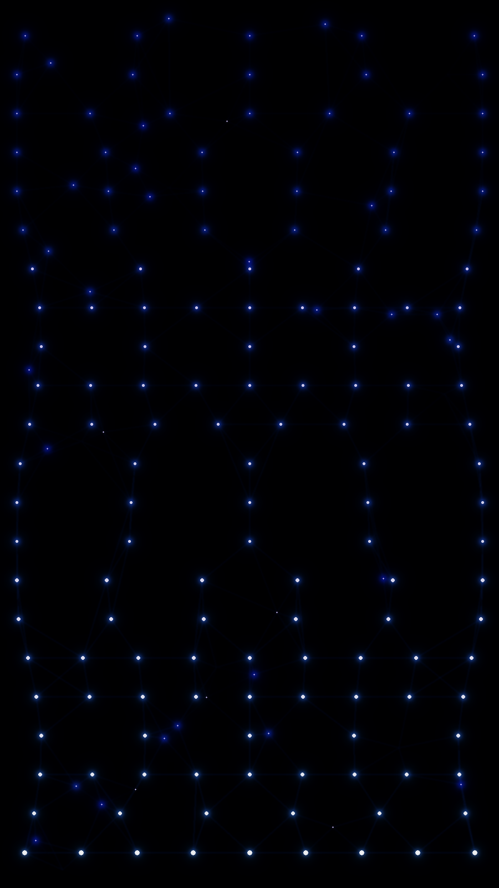

<table>
<tr>
<td width="45%" valign="top">

</td>
<td width="55%" valign="top">

<h2>Andrius Anselmi</h2>

Computer Science student and Software Engineer Intern.
Work spans mobile development with Flutter and Kotlin, and backend exploration with Java and Spring Boot.
Main interests include algorithms, data structures, and building real-world solutions.

<h3>Areas of Interest</h3>
<ul>
  <li>Mobile development (Android, Flutter)</li>
  <li>Backend architecture and REST APIs</li>
  <li>Algorithms and data structures</li>
  <li>Low-level programming (C, C++)</li>
  <li>Software engineering best practices</li>
</ul>

<h3>Technologies</h3>
<ul>
  <li><b>Mobile:</b> Flutter, Dart, Kotlin, Android Studio</li>
  <li><b>Backend:</b> Java, Spring Boot, Python</li>
  <li><b>Systems:</b> C, C++</li>
  <li><b>Tools:</b> Git, Linux</li>
</ul>

<h3>Contact</h3>
<ul>
  <li>Email: aandrius.anselmi@gmail.com</li>
  <li>Location: Porto Alegre, RS — Brazil</li>
</ul>

</td>
</tr>
</table>
